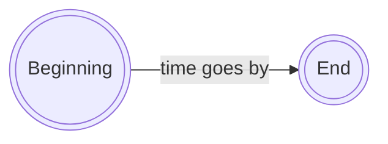
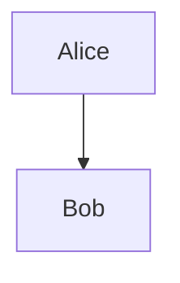
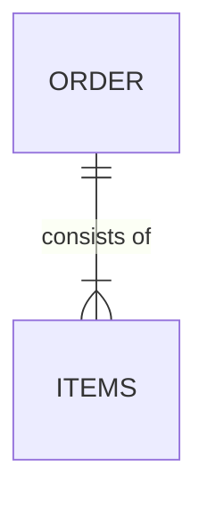

# github-markdown

try github's markdown features

## Mermaid

### flowchart LR

``` mermaid
flowchart LR

a(((Beginning))) -- time goes by --> b(((End)))
```

### flowchart UD

```mermaid
flowchart TD

Alice --> Bob
```

### graph

```mermaid
graph

Alice --> Bob
```

### erDiagram

```mermaid
erDiagram

ORDER ||--|{ ITEMS: "consists of"

```

